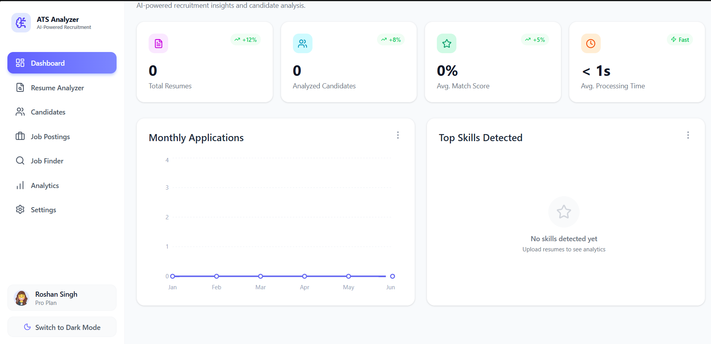
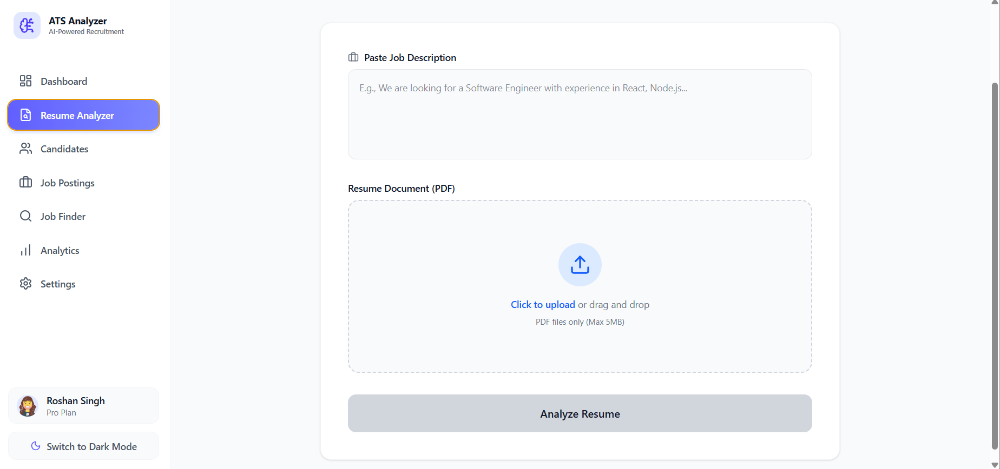
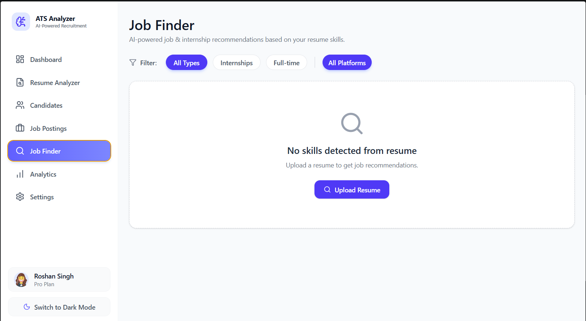
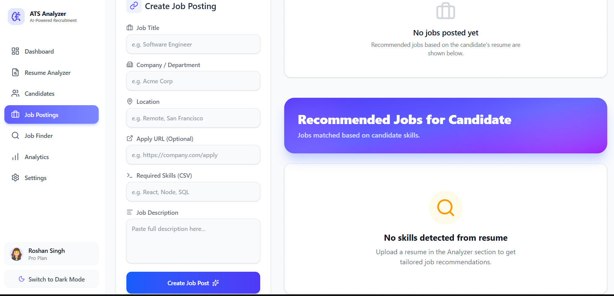
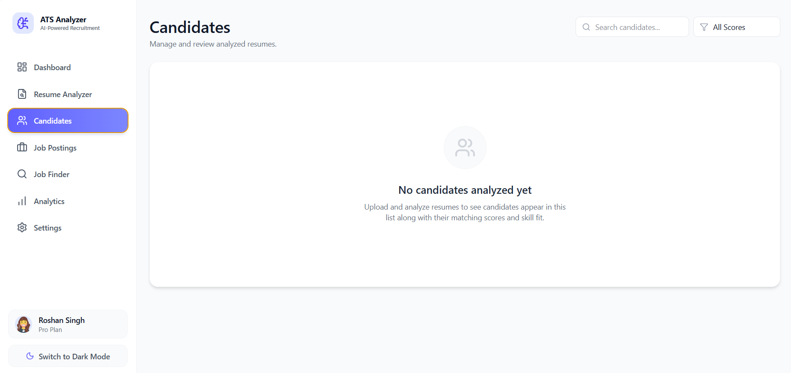

<p align="center">
  
</p>

<h1 align="center">🧠 AI Resume Analyzer & ATS Platform</h1>

<p align="center">
  <strong>An intelligent, full-stack Applicant Tracking System (ATS) engineered to modernize and streamline the recruitment lifecycle.</strong><br>
  Powered by Google Gemini AI, it autonomously parses resumes, evaluates them against specific job requisitions, and surfaces top talent instantly—reducing manual screening time drastically.
</p>

<p align="center">
  
  
  
  
  
  
</p>

---

## 💡 The Problem & Solution

Traditional recruitment involves manually reading hundreds of resumes to find a single qualified candidate, leading to fatigue, bias, and prolonged hiring cycles.

**AI Resume Analyzer** solves this by automating the initial screening phase. By combining a premium, responsive user interface with advanced Natural Language Processing (via Google Gemini AI), the platform reads resumes, compares them contextually against job descriptions, and outputs a highly accurate compatibility score alongside actionable insights.

## 🚀 Key Technical Achievements

- **Seamless AI Integration:** Engineered a robust backend service that integrates `@google/generative-ai` to perform complex, contextual analysis of unstructured PDF parsing data, mapping raw text to structured JSON assessments.
- **High-Performance UI/UX:** Built with React 19, Vite, and TailwindCSS 4, featuring a "zero-loading-state perception" through optimistic UI updates, Framer Motion animations, and custom skeleton loaders.
- **Actionable Data Visualization:** Implemented dynamic real-time recruitment dashboards using Recharts, presenting complex datasets (skills distribution, application volume trends) in an easily digestible format.
- **Robust Full-Stack Architecture:** Designed a scalable MERN stack application utilizing a clear separation of concerns (Controllers, Routes, Services) and secure, RESTful endpoints.

---

## 📸 Platform Walkthrough

### 1. Dashboard & Analytics

> Executive view of real-time KPIs, monthly application trends, and AI-detected top skills. Designed for quick, data-driven decision-making.



### 2. Intelligent Resume Analyzer

> The core AI engine. Upload a PDF resume and supply a job description. The system instantly evaluates ATS compatibility, identifies exact skill gaps, and extracts core competencies dynamically.



### 3. Smart Job Finder

> AI-powered talent sourcing mapped from extracted candidate skills. Features fluid hover animations, dynamic match score badges, and intelligent edge case handling (e.g., graceful empty states).



### 4. Job Requisitions & Talent Pool

> Create active job postings and manage the centralized candidate database. View detailed AI analysis for any applicant with a single click.




---

## ✨ Core Features & Business Impact

| Feature                        | Business Value                                                                                             |
| ------------------------------ | ---------------------------------------------------------------------------------------------------------- |
| 🤖 **Automated Screening**     | Eliminates hours of manual PDF parsing by instantly evaluating candidate profiles.                         |
| 📊 **Precision Match Scoring** | Delivers objective, percentage-based compatibility scores to rank applicants immediately.                  |
| 🔍 **Skill Gap Analysis**      | Highlights exact technical and soft skill matches, significantly reducing hiring bias.                     |
| 📈 **Interactive Analytics**   | Visualizes application trends and candidate quality through a sleek, real-time dashboard.                  |
| 💼 **Smart Job Sourcing**      | Recommends relevant job openings based directly on a candidate's extracted profile.                        |
| 🎨 **Premium UX/UI**           | Built with an engaging, accessible, and highly responsive modern interface (Dark Mode natively supported). |

---

## 🏗️ Comprehensive Tech Stack

### Frontend Architecture

- **Framework:** React 19 + Vite 7 (Optimized for lightning-fast HMR and build times)
- **Styling:** TailwindCSS 4 (Utility-first, highly customized design system)
- **Animations:** Framer Motion (Orchestrating complex staggered page transitions)
- **Data Visualization:** Recharts (Interactive Area, Bar, and Doughnut charts)
- **State & Data Fetching:** SWR (Stale-while-revalidate for performant caching, syncing, and refetching)
- **Routing:** React Router DOM v7 (Client-side routing with optimized layouts)

### Backend Architecture

- **Runtime & Framework:** Node.js with Express 5
- **Database Layer:** MongoDB with Mongoose ODM (Includes MongoDB Memory Server for zero-config local prototyping)
- **AI Services:** Google Generative AI SDK (`@google/generative-ai`)
- **File Processing:** Multer handling multipart/form-data & `pdf-parse` for robust text extraction.

---

## 🚀 Local Development Setup

Want to run the project locally? It runs seamlessly with in-memory databases!

### Prerequisites

- Node.js (v18+)
- npm (v9+)
- [Google Gemini API Key](https://aistudio.google.com/apikey)

### 1. Clone & Setup Backend

```bash
git clone https://github.com/RoshanSingh23bce7767/ai-resume-analyzer.git
cd ai-resume-analyzer/server

# Install dependencies
npm install

# Create environment file
echo "PORT=5001\nGEMINI_API_KEY=your_google_gemini_api_key_here" > .env

# Start the server (MongoDB spins up automatically in-memory!)
npm run dev
```

### 2. Setup Frontend

```bash
# In a new terminal
cd ai-resume-analyzer/client

# Install dependencies
npm install

# Start the React application
npm run dev
```

Navigate to `http://localhost:5173` to explore the platform.

---

## 🔌 Core API Architecture

The backend exposes a clean, RESTful API architecture.

| Method     | Endpoint              | Description                                                                   |
| ---------- | --------------------- | ----------------------------------------------------------------------------- |
| `POST`     | `/api/resume/analyze` | Core AI Route: Uploads PDF, parses text, and queries Gemini for ATS matching. |
| `GET`      | `/api/candidates`     | Retrieves the paginated talent pool database.                                 |
| `GET`      | `/api/job-finder`     | Triggers the AI recommendation engine based on saved skills.                  |
| `GET`      | `/api/analytics`      | Aggregates and serves metrics for dashboard data visualization.               |
| `GET/POST` | `/api/jobs`           | CRUD operations for managing job requisitions.                                |

---

## 🤝 Let's Connect!

I built this platform to showcase my ability to design, architect, and deploy complex, full-stack AI applications that solve real-world problems with premium UX/UI.

If you're a recruiter or engineering manager, I'd love to chat about how my skills can bring value to your engineering team!

<p align="center">
  Engineered with ❤️ by <strong>Roshan Singh</strong>
</p>
